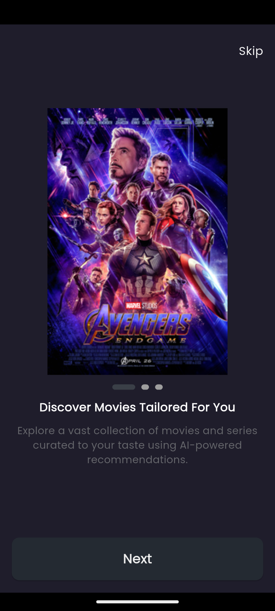
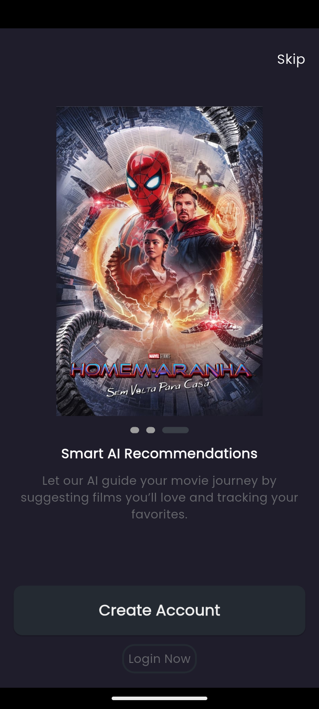

# AI Movie App 🎬

This application is built following **Clean Architecture** principles, leveraging **Dependency Injection**, **Shared Preferences**, and **Cubit/BLoC** for state management.

The entire app is designed with scalability and maintainability in mind, following a modular structure to separate concerns and ensure clean, testable code.

---

## Project Highlights ✨

- **Clean Architecture** for clear separation of layers and maintainable code.
- **Dependency Injection** to manage and inject dependencies easily.
- **Cubit/BLoC** state management for predictable and testable states.
- **Shared Preferences** for lightweight persistent data storage.
- **GoRouter** for flexible and clean navigation handling.
- **Service Locator** for easy dependency management across the app.

These patterns and tools are integrated throughout the entire application from the very beginning.

---

## First Implemented Feature: Splash Screen ✨

The **Splash Screen** is the first feature added to the app.  
It handles initial routing logic through the `DecideStartDestinationUseCase` and integrates seamlessly with the app’s theme system.

**Key Highlights of Splash Feature:**
- Clean routing with **GoRouter**.
- Theme initialization using **Shared Preferences** and `ThemeCubit`.
- Integrated with **Service Locator** for dependency management.
- White theme option alongside the original color palette.
- Minor structural improvements and cleanup.

---

## Screenshots 📸

  

---

## Second Implemented Feature: OnBoarding Screen 🎉

The **OnBoarding Screen** introduces new users to the app features with a clean UI and smooth navigation.  
It is fully integrated using **Clean Architecture** principles with **Cubit** for state management and **Shared Preferences** to track if the onboarding was already visited.

**Key Highlights of OnBoarding Feature:**
- Uses **local data only** for images and text (no remote API required).
- Implements **OnBoardingLocalDataSource** and **OnBoardingRepository**.
- Includes **GetOnBoardingDataUseCase** and **SetOnBoardingVisitedUseCase**.
- Integrates **OnBoardingCubit** for state management.
- Provides **skip functionality** to navigate directly to SignUp/SignIn.
- Connects UI buttons with Cubit actions instead of direct local calls.
- OnBoarding pages display **3 slides** with informative text and images.
- Images for OnBoarding included in README for reference.

---

## OnBoarding Screenshots 📸

  
  
  

---

